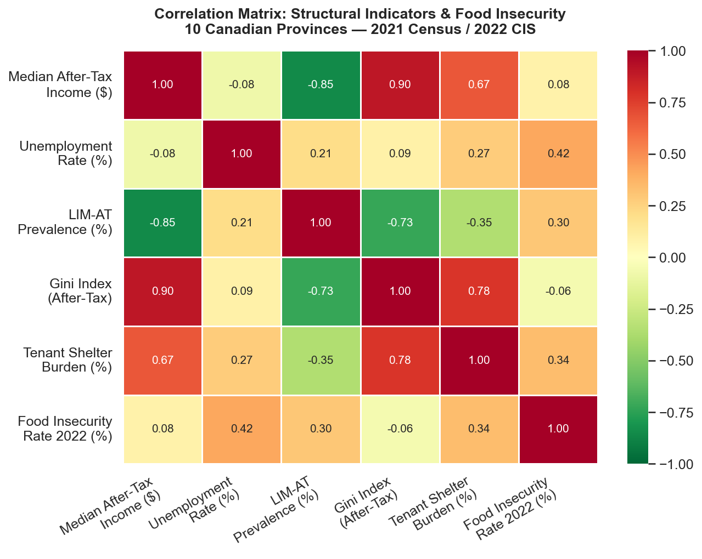
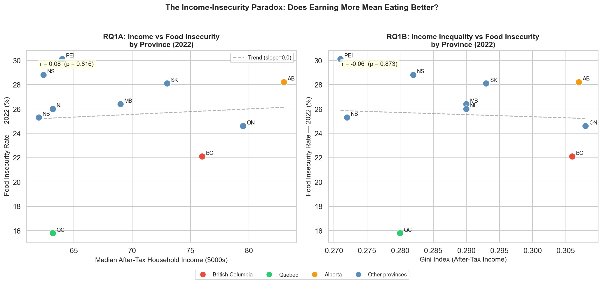
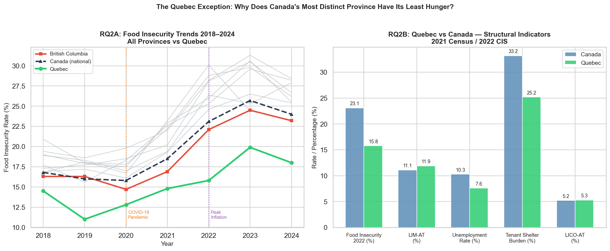
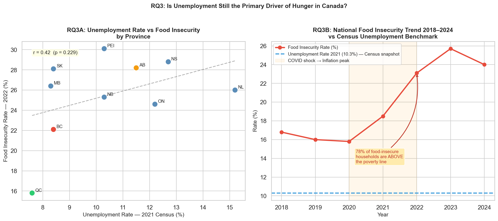
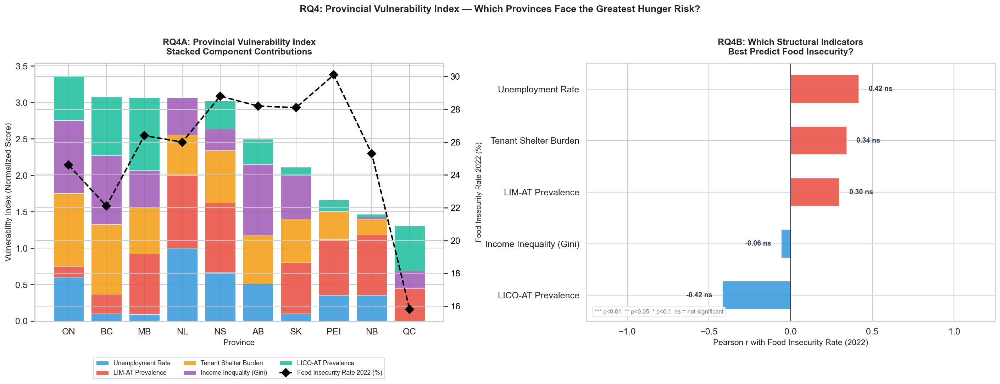
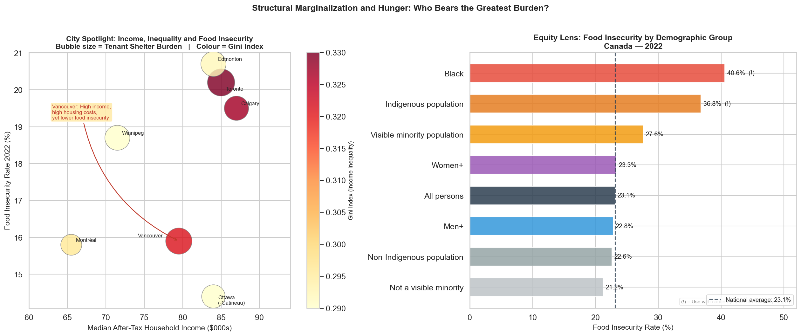

# Food Insecurity and Poverty in Canada

### *One in four Canadians could not reliably afford food in 2024. Most of them have jobs. This project investigates why.*

---

Between 2018 and 2024, food insecurity in Canada rose by 43 percent. That is the fastest sustained increase in Canadian history. By 2024, 10 million Canadians — including 2.5 million children — were living in households that struggled to afford food.

The intuitive explanation is that this is a poverty problem. That people who are unemployed, or living in poor provinces, or earning low incomes, are the ones going hungry.

The data tells a different story.

**78 percent of food-insecure Canadian households are employed and living above the official poverty line.** Alberta has the highest median income of any province and one of the worst food insecurity rates. Quebec has among the lowest incomes and by far the lowest hunger rate. The connection between earning more and eating reliably has broken down in Canada. This project investigates what has replaced it.

---

## What This Project Does

This analysis uses three Statistics Canada datasets to examine how structural conditions — housing costs, income inequality, unemployment, and social marginalization — interact to drive food insecurity across Canadian provinces and cities. Four research questions guide the investigation.

**Does earning more money protect against hunger?** The answer, at the provincial level, is effectively no.

**Why does Quebec consistently have the lowest food insecurity despite not being the richest province?** The answer involves housing affordability and social policy design, not income.

**Has unemployment stopped being the main driver of hunger?** The data shows the two have largely decoupled since 2018.

**Which provinces are most structurally at risk, and what puts them there?** A composite vulnerability index built from five structural indicators provides the answer.

---

## The Data

Three datasets, all from Statistics Canada, all publicly available under the Statistics Canada Open Licence.

| Dataset | What it covers | Geography |
|---|---|---|
| `census_province_2021.csv` | Income, housing costs, unemployment, inequality — 2021 Census | 10 provinces and Canada |
| `census_cma_2021.csv` | Same indicators for Canada's 41 largest cities — 2021 Census | 41 Census Metropolitan Areas |
| `food_insecurity_2018_2024.csv` | Annual food insecurity rates by province, severity and demographics | Provinces and territories |

A fourth source, a Statistics Canada research article by Uppal (2023), provides city-level food insecurity rates for the seven largest Canadian cities.

> `census_cma_2021.csv` is 66MB and is not included in this repository. Download it from Statistics Canada as Table 98-401-X2021002 and place it in the `data/` folder.
>
> The provincial dataset includes a row for Canada as a whole. This is kept deliberately as a national benchmark for comparison charts. All correlation analyses and the vulnerability index use provinces only, with the Canada row excluded via `prov_only = master_prov[~master_prov['is_canada']]`.

---

## The Findings

### How the structural indicators relate to each other

Before asking which factors predict hunger, it helps to understand how the structural indicators relate to each other. The chart below is a correlation matrix. Each cell shows how strongly two indicators move together across the ten provinces. A number close to 1.0 means they tend to be high in the same provinces. A number close to negative 1.0 means they move in opposite directions. Zero means no relationship.



The most important number in this chart is the 0.08 in the bottom left, where median income meets food insecurity. That is essentially zero — provinces that earn more do not systematically have less hunger. The strongest direct link to food insecurity is tenant shelter burden at 0.34. Provinces where more renters spend 30 percent or more of their income on housing tend to have more people going hungry. When rent takes most of your paycheque, there is less left for food.

---

### Does earning more protect you from hunger?



Each dot is a province. In the left chart, moving right means higher median household income. Moving up means higher food insecurity. If money protected against hunger, the dots would slope downward from left to right. Instead, the trend line is almost completely flat.

Alberta sits at the far right with the highest median income in Canada at 83,000 dollars per household. Its food insecurity rate is 28.2 percent, fourth worst in the country. Quebec sits in the bottom left, with a median income of 63,200 dollars and a food insecurity rate of just 15.8 percent, the best in the country by a wide margin. The right chart asks the same question about income inequality rather than income level. The answer is the same: no relationship.

**The provincial income level has essentially no relationship with how many people in that province go hungry.**

---

### Why Quebec is different from everyone else



The left chart is a timeline from 2018 to 2024. Every line is a province. The green line running well below everything else throughout is Quebec. When COVID hit in 2020, food insecurity dipped briefly because of federal emergency payments. Then from 2021 onward, as payments ended and inflation surged, food insecurity exploded almost everywhere. Quebec barely moved. It was the only province in Canada where hunger did not meaningfully increase through the worst economic shock in a generation.

The right chart shows why. Quebec's tenant shelter burden is 25.2 percent. The national average is 33.2 percent. That eight-point gap is the single biggest structural difference between Quebec and the rest of Canada. When renters in Quebec pay their rent, they have significantly more money left for food. Quebec also has the lowest unemployment rate among all provinces at 7.6 percent, 10-dollar-per-day childcare, stronger rent controls, and a more comprehensive social assistance system.

**Quebec does not have the highest income. It has the best structural protection. The lesson is that how a society is built matters more than how wealthy it is.**

---

### Has unemployment stopped explaining hunger?



The left chart plots unemployment against food insecurity by province. There is a slight upward slope but the relationship is weak and unreliable. The right chart makes the bigger point. Food insecurity rose from 16.8 percent to 25.7 percent between 2018 and 2023 while the national unemployment rate stayed broadly stable. These two series have separated from each other entirely.

The annotation in the chart explains why: 78 percent of food-insecure families have jobs and live above the poverty line. They are working. They are earning. But housing costs grew faster than wages, and the gap between what working people earn and what they need to cover basic costs quietly became a hunger crisis.

**Getting a job is no longer enough to guarantee you can afford to eat in Canada.**

---

### Which provinces are most structurally at risk?



The left chart combines five structural indicators into a single vulnerability score for each province. The bars show each province's total score with colours indicating which indicator contributes most. The black diamond line shows the actual food insecurity rate. Ontario ranks most structurally vulnerable, followed closely by British Columbia. Neither has the worst food insecurity outcome, which suggests other factors are partially buffering them. Quebec ranks last on the vulnerability index with a score of 0.26, roughly two and a half times lower than Ontario at 0.67, and its food insecurity outcome is the best in the country.

The right chart shows how well each individual indicator predicts food insecurity on its own. None reach statistical significance with only ten provinces. This is itself an important finding: food insecurity is not caused by any single fixable thing. It requires improving multiple structural conditions at the same time.

---

### Who bears the heaviest burden



The left chart compares Canada's seven largest cities. Each bubble is a city, sized by housing cost burden and coloured by income inequality. Vancouver has the largest bubble — 38.5 percent of its renters are housing-cost-burdened — yet its food insecurity rate of 15.9 percent is near the national average. Edmonton and Toronto sit at the top with the highest city-level food insecurity despite high median incomes.

The right chart shows who within Canada bears the most severe burden. The vertical dashed line is the national average of 23.1 percent.

| Group | Food Insecurity Rate |
|---|---|
| Black Canadians | 40.6% |
| Indigenous peoples | 36.8% |
| Visible minority population | 27.6% |
| Women+ | 23.3% |
| National average | 23.1% |
| Non-Indigenous population | 22.6% |
| Not a visible minority | 21.2% |

These disparities persist above the poverty line and across income levels. A Black Canadian family earning above the poverty line is still more than twice as likely to be food insecure as a non-racialized family at the same income. These are not income gaps. They are structural barriers: discrimination in labour and housing markets, the effects of colonization on Indigenous economic participation, and the financial weight of raising children alone on a single income.

---

## The Short Version

**Earning more does not protect against hunger.** Alberta earns the most and has among the worst food insecurity. Quebec earns among the least and has the best. Income has no meaningful relationship with food insecurity at the provincial level.

**Social policy design is the decisive factor.** Quebec has held the lowest food insecurity in Canada for years not because it is richer but because its housing costs are lower and its social programs are stronger. Every other province surged during COVID. Quebec barely moved.

**Employment no longer protects against hunger.** Seven in ten food-insecure Canadians have jobs. Food insecurity has risen 43 percent since 2018 while employment has stayed broadly stable. Housing inflation and stagnant wages changed the fundamental arithmetic of working life.

**The burden falls hardest on specific communities.** Black Canadians, Indigenous peoples, visible minorities, and female lone-parent families face food insecurity at rates far above the national average, and those disparities cannot be explained by income differences alone.

---

## Repository Contents

```
food_bank_poverty_canada/
│
├── data/
│   ├── census_province_2021.csv
│   ├── food_insecurity_2018_2024.csv
│   └── census_cma_2021.csv            (download separately)
│
├── export/
│   ├── correlation_heatmap.png
│   ├── rq1_income_insecurity_paradox.png
│   ├── rq2_quebec_exception.png
│   ├── rq3_unemployment_food_insecurity.png
│   ├── rq4_vulnerability_index.png
│   ├── city_spotlight_equity.png
│   ├── master_provincial.csv
│   ├── census_cma_clean.csv
│   ├── food_insecurity_trend.csv
│   ├── food_insecurity_severity_2022.csv
│   └── vulnerability_index.csv
│
├── notebooks/
│   ├── analysis.ipynb
│   └── analysis.html
│
├── food_bank_poverty_canada.pptx
├── food_bank_poverty_canada_report.pdf
├── README.md
└── .gitignore
```

---

## How to Run

```bash
git clone https://github.com/EdwardAgyemang/food-bank-poverty-canada.git
cd food-bank-poverty-canada

pip install pandas numpy matplotlib seaborn scipy jupyter

jupyter notebook notebooks/analysis.ipynb
```

Download `census_cma_2021.csv` from Statistics Canada Table 98-401-X2021002 and place it in `data/` before running city-level analysis cells.

---

## About

**Edward Agyemang**
MPS Data Analytics, Northeastern University Vancouver, 2026
github.com/EdwardAgyemang | edward.agyemang@northeastern.edu

This analysis was motivated by four years of building operations work across 13 properties in Vancouver's Downtown Eastside, where the structural causes of hunger are not abstract. The data in this report describes at a national scale what I observed in person every day.

---

## Data Sources

Statistics Canada (2022). Census Profile, 2021 Census of Population. Tables 98-401-X2021001 and 98-401-X2021002. https://www12.statcan.gc.ca/census-recensement/2021/dp-pd/prof/

Statistics Canada (2025). Food insecurity by selected demographic characteristics. Table 13-10-0835-01. https://doi.org/10.25318/1310083501-eng

Uppal, S. (2023). Food insecurity among Canadian families. Statistics Canada, Catalogue no. 75-006-X. https://www150.statcan.gc.ca/n1/pub/75-006-x/2023001/article/00013-eng.htm

All data reproduced under the Statistics Canada Open Licence.

---

*Last updated May 2026*
